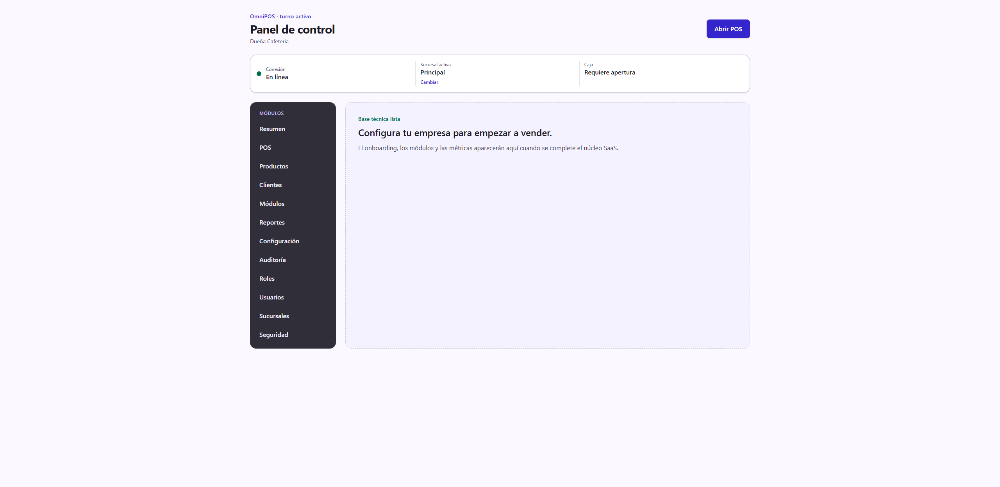
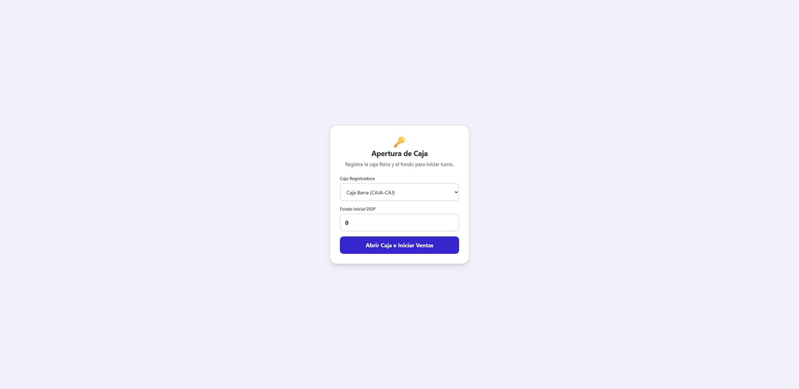
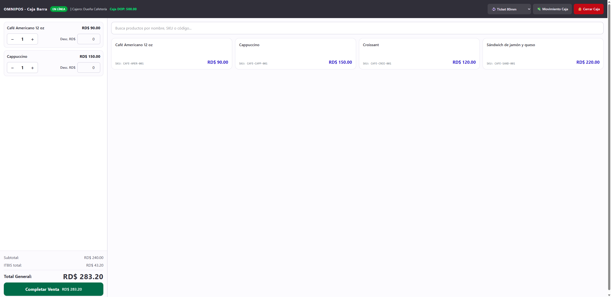

# Guía de uso — Cafetería ☕

**Cuenta demo:** `demo.cafeteria@omnipos.test` · contraseña `Password123!`
**Empresa:** Cafetería Aroma

Una cafetería es una **barra rápida para llevar**: el flujo se centra en el POS,
con productos que a veces llevan inventario (sándwiches, pan) y otros no
(bebidas preparadas al momento).

> Antes de empezar, revisa **[Acceso al sistema](../_comun/GUIA.md)**.

## El panel de la cafetería

En el menú lateral verás **POS**, **Productos**, **Inventario**, **Clientes**,
**Reportes** y **Configuración**.

---

## Ciclo operativo completo

### Paso 1 — Abrir la caja

Entra a **POS**. Elige la caja (**Caja Barra**) y escribe el **fondo inicial**.
Pulsa **Abrir Caja e Iniciar Ventas**.

### Paso 2 — Vender rápido

Toca las bebidas y alimentos para agregarlos al carrito. Las bebidas preparadas
al momento (café, cappuccino) pueden ir **sin control de inventario**, mientras
que sándwiches y pan sí descuentan existencias.

### Paso 3 — Cobrar

Pulsa **Completar Venta**, elige el método de pago y **Confirma e Imprime**. El
detalle del cobro es el mismo de la
[guía de Ferretería](../Ferreteria/GUIA.md#paso-5--cobrar).

---

## Resumen del ciclo

1. **POS** → abrir caja (Caja Barra).
2. Tocar bebidas/alimentos → **Completar Venta**.
3. Cobrar → **Confirmar e Imprimir**.
4. **Cerrar Caja** al final del turno.

> Consejo: para la barra, deja las bebidas preparadas **sin inventario** (no
> tiene sentido contar cafés) y controla stock solo en lo empacado.
