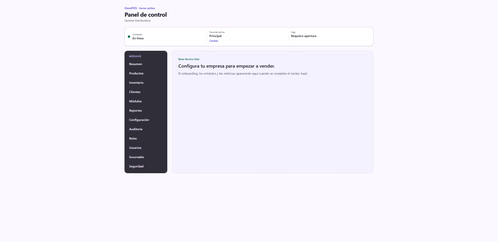
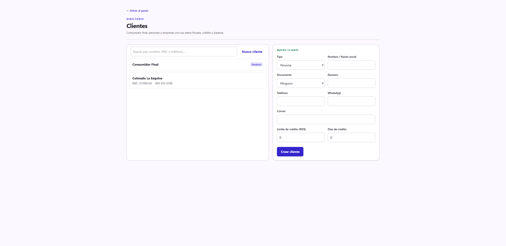
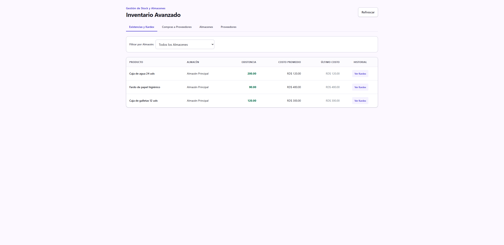

# Guía de uso — Distribuidora 🚚

**Cuenta demo:** `demo.distribuidora@omnipos.test` · contraseña `Password123!`
**Empresa:** Distribuidora del Cibao

Una distribuidora vende **al por mayor**, normalmente **a crédito** a colmados y
negocios, y se abastece con **compras a proveedores**. Su preset se centra en
inventario, compras y cuentas por cobrar/pagar (no en el POS táctil).

> Antes de empezar, revisa **[Acceso al sistema](../_comun/GUIA.md)**.

## El panel de la distribuidora

En el menú lateral verás **Productos**, **Inventario**, **Clientes**,
**Reportes** y **Configuración**. Nota que **no trae POS** por defecto: el POS
Touch es un módulo *recomendado* que puedes activar en **Configuración →
Módulos** si además atiendes venta de mostrador.

---

## Ciclo operativo

### Paso 1 — Registrar clientes con crédito

Entra a **Clientes**. Para un cliente mayorista, además de su **razón social** y
**RNC**, define su **Límite de crédito (RD$)** y sus **Días de crédito**. En la
demo está *Colmado La Esquina* (RNC 131000142, límite RD$50,000, 30 días).

### Paso 2 — Abastecerte (compras a proveedores)

Entra a **Inventario**. En la pestaña **Proveedores** registras a tus
suplidores, y en **Compras a Proveedores** registras las entradas de mercancía
(cantidad, costo, y lote/vencimiento cuando aplica). Cada compra suma stock y
actualiza el costo promedio, visible en **Existencias y Kardex**.

### Paso 3 — Vender

- **Venta de mostrador:** activa el módulo **POS Touch** y sigue el flujo de la [guía de Ferretería](../Ferreteria/GUIA.md); podrás cobrar de contado o a **crédito** (método "Crédito" en el cobro), lo que carga el balance del cliente.
- **Cuentas por cobrar/pagar:** el control detallado de saldos de crédito de clientes y deudas con proveedores está en el plan de desarrollo (backlog post-v1). Hoy el límite y los días de crédito quedan registrados en la ficha del cliente.

---

## Resumen del ciclo

1. **Clientes** → registrar mayoristas con límite y días de crédito.
2. **Inventario → Proveedores / Compras** → abastecer stock.
3. Vender (activando POS Touch si atiendes mostrador; venta a crédito disponible).
4. Revisar **Reportes**.

> Estado actual: la distribuidora ya gestiona clientes con crédito, inventario y
> compras. Las pantallas de **cuentas por cobrar/pagar** completas llegan en una
> fase posterior.
