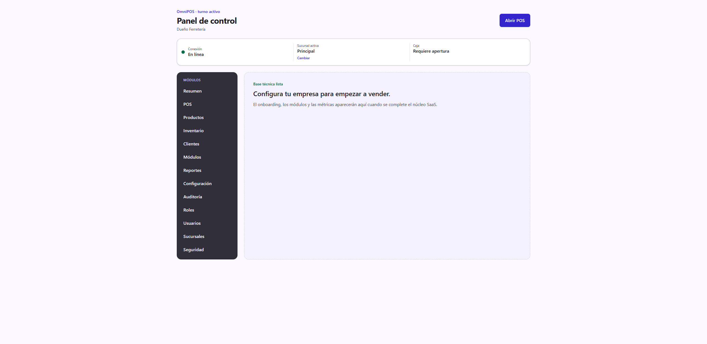
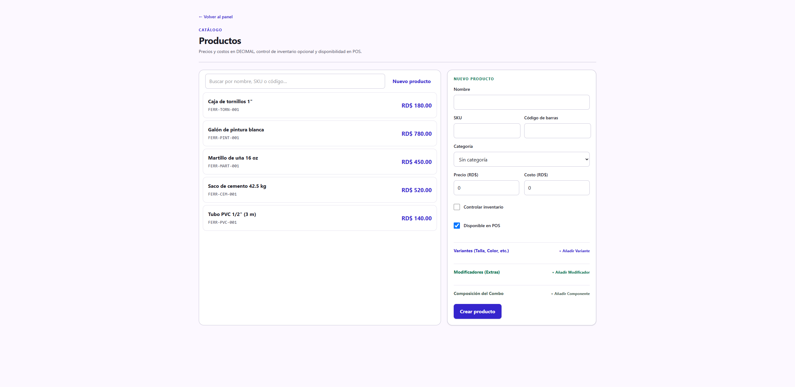
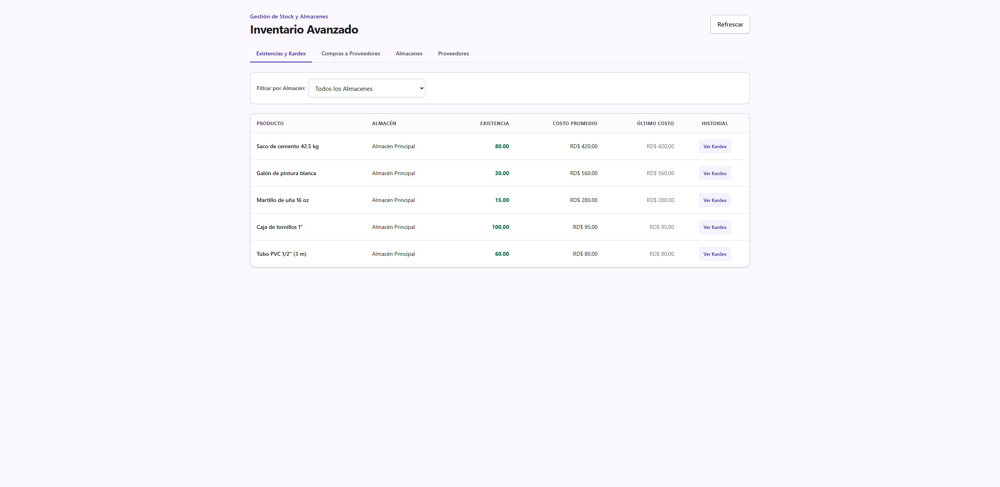
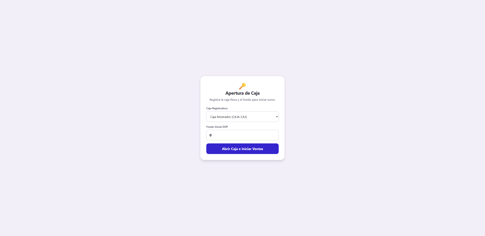
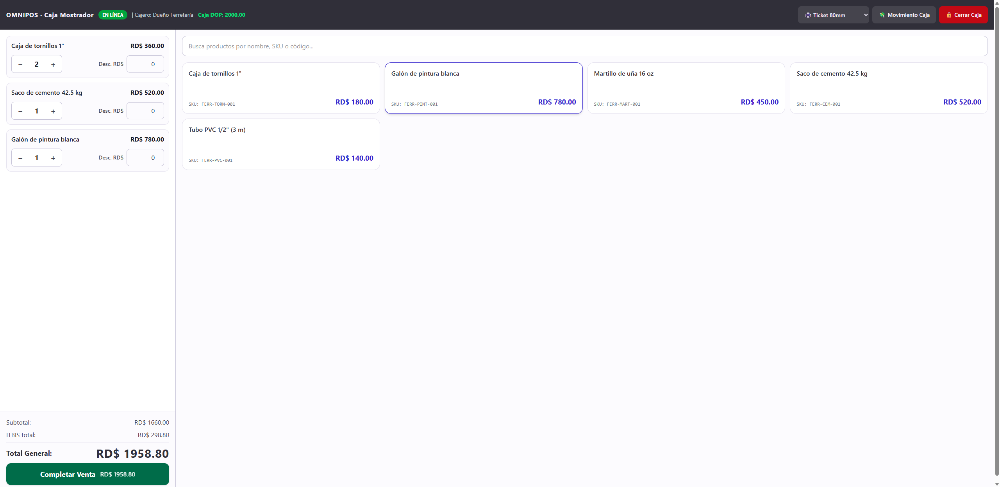
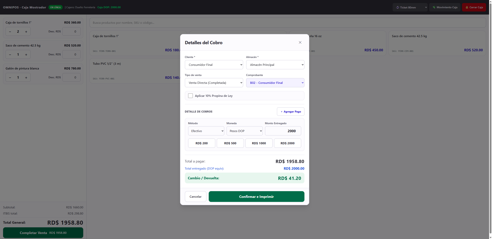
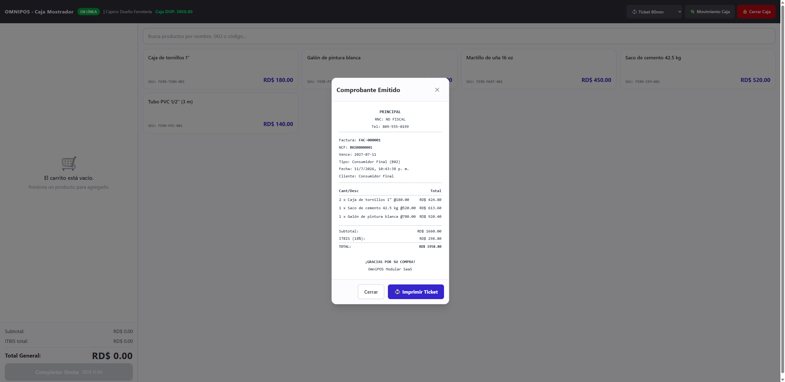

# Guía de uso — Ferretería 🔧

**Cuenta demo:** `demo.ferreteria@omnipos.test` · contraseña `Password123!`
**Empresa:** Ferretería El Tornillo

Una ferretería es un negocio de **venta al detalle con inventario**: registras
materiales, controlas sus existencias y los vendes en el punto de venta (POS)
emitiendo un comprobante fiscal. Este es el ciclo más completo del sistema.

> Antes de empezar, revisa **[Acceso al sistema](../_comun/GUIA.md)** para
> iniciar sesión y elegir la sucursal.

## El panel de la ferretería

En el menú lateral verás **Productos**, **Inventario**, **POS**, **Clientes**,
**Reportes** y **Configuración**.

---

## Ciclo operativo completo

### Paso 1 — Registrar tus productos

Entra a **Productos**. A la derecha, en **Nuevo producto**, completa:

- **Nombre** y **SKU** (código interno) — opcionalmente **Código de barras**.
- **Precio** (lo que cobras) y **Costo** (lo que te cuesta).
- Marca **Controlar inventario** para llevar existencias.
- Deja **Disponible en POS** para que aparezca en la caja.

Pulsa **Crear producto**. En la demo ya hay cemento, pintura, martillo,
tornillos y tubo PVC.

### Paso 2 — Revisar y cargar existencias (Inventario)

Entra a **Inventario**. La pestaña **Existencias y Kardex** muestra cada
producto con su **existencia**, **costo promedio** y **último costo**. Para ver
todos los movimientos de un producto pulsa **Ver Kardex**.

> Las entradas de mercancía (compras a proveedores) se registran en la pestaña
> **Compras a Proveedores**, que suma stock y calcula el costo promedio.

### Paso 3 — Abrir la caja

Entra a **POS**. Antes de vender debes **abrir la caja**: elige la **caja
registradora** y escribe el **fondo inicial** (el efectivo con que arrancas el
turno). Pulsa **Abrir Caja e Iniciar Ventas**.

### Paso 4 — Armar la venta

Con la caja abierta, toca los **productos** del panel derecho para agregarlos al
**carrito** (izquierda). Por cada línea puedes:

- Ajustar la **cantidad** con los botones **−** / **+**.
- Aplicar un **descuento** en RD$.

Abajo se calculan **Subtotal**, **ITBIS total** y **Total General**
automáticamente.

### Paso 5 — Cobrar

Pulsa **Completar Venta**. En **Detalles del Cobro**:

1. Confirma el **Cliente** (Consumidor Final por defecto) y el **Almacén** de donde sale la mercancía.
2. Elige el **Comprobante**: **B02 – Consumidor Final** (lo normal) o **B01 – Crédito Fiscal** (si el cliente tiene RNC).
3. En **Detalle de Cobros** indica el **método** (efectivo, tarjeta, transferencia…) y el **monto entregado**. Los botones rápidos (RD$ 200/500/1000/2000) agilizan el efectivo.
4. El sistema calcula la **devuelta** y la resalta en verde.
5. Pulsa **Confirmar e Imprimir**.

### Paso 6 — Comprobante emitido

Se genera la factura con su **NCF** fiscal. Desde aquí puedes **Imprimir
Ticket** (58 mm, 80 mm o carta A4 según lo configurado). El importe cobrado
entra a la caja y el stock de los productos vendidos baja automáticamente.

### Paso 7 — Cierre y reportes

- Al terminar el turno, en el POS pulsa **🔒 Cerrar Caja** y registra el efectivo contado; el sistema muestra la **diferencia** (arqueo).
- En **Reportes** ves las ventas del período, desgloses por producto/categoría/método de pago y los formatos fiscales **DGII 606/607/608**, exportables a CSV, Excel y PDF.

---

## Resumen del ciclo

1. **Productos** → registrar materiales (precio, costo, inventario).
2. **Inventario** → cargar/revisar existencias.
3. **POS** → abrir caja con fondo inicial.
4. Tocar productos → armar carrito → **Completar Venta**.
5. Elegir comprobante y método de pago → **Confirmar e Imprimir**.
6. **Cerrar Caja** (arqueo) y revisar **Reportes**.
