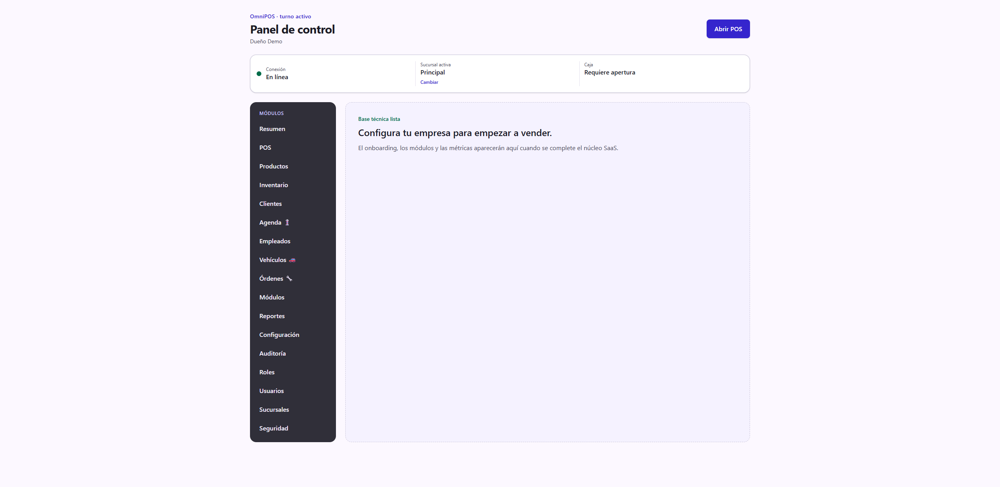
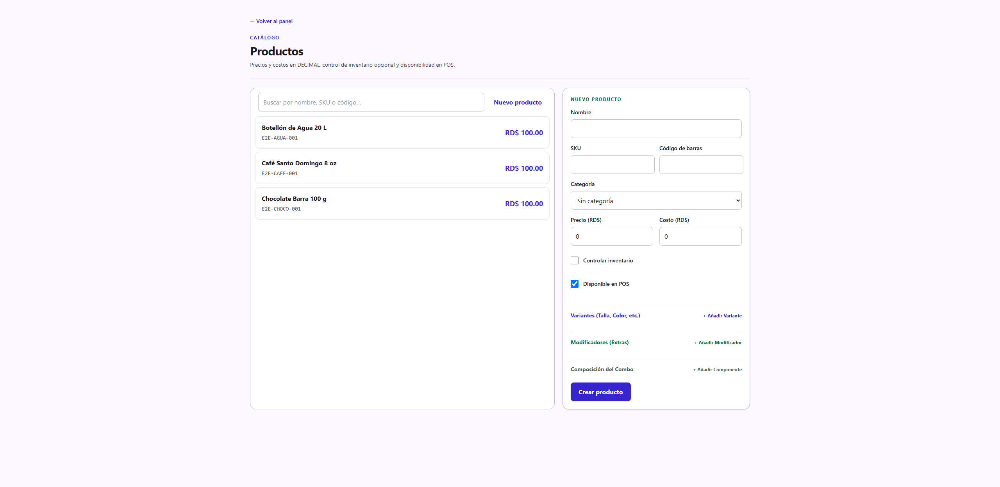
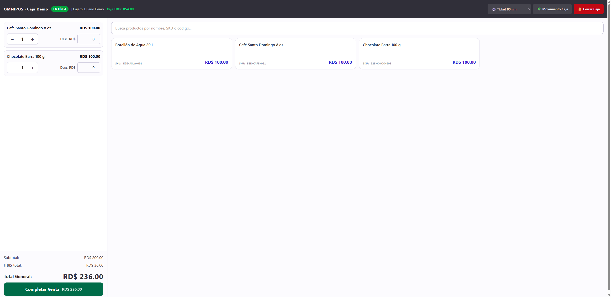
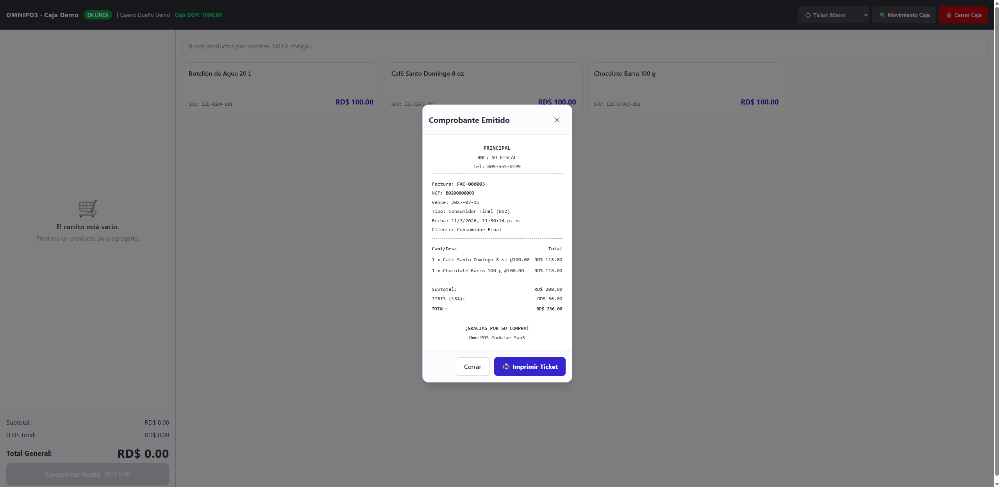

# Guía de uso — Colmado / Minimarket 🏪

**Cuenta demo:** `demo@omnipos.test` · contraseña `Password123!`
**Empresa:** OmniPOS Demo

Un colmado o minimarket es venta al detalle rápida con inventario. El ciclo es
el más directo: registras productos, los vendes en el POS y emites el
comprobante. Es prácticamente idéntico al de una ferretería.

> Antes de empezar, revisa **[Acceso al sistema](../_comun/GUIA.md)**.

## El panel del colmado

En el menú lateral verás **POS**, **Productos**, **Inventario**, **Clientes**,
**Reportes** y **Configuración**.

---

## Ciclo operativo completo

### Paso 1 — Registrar productos

Entra a **Productos** y crea cada artículo con su **nombre**, **SKU**,
**precio**, **costo**, marcando **Controlar inventario** y **Disponible en POS**.

### Paso 2 — Vender en el POS

Entra a **POS**, **abre la caja** con su fondo inicial y toca los productos para
agregarlos al carrito. Se calculan Subtotal, ITBIS y Total automáticamente.

### Paso 3 — Cobrar y emitir el comprobante

Pulsa **Completar Venta**, confirma el cliente (Consumidor Final), el
comprobante (B02) y el método de pago; el sistema calcula la devuelta. Al
**Confirmar e Imprimir** se emite la factura con su NCF, el importe entra a la
caja y baja el stock.

> El detalle paso a paso del cobro (pagos mixtos, tarjeta, USD, propina) está en
> la [guía de Ferretería](../Ferreteria/GUIA.md#paso-5--cobrar); el flujo es el
> mismo.

---

## Resumen del ciclo

1. **Productos** → registrar artículos.
2. **POS** → abrir caja.
3. Tocar productos → **Completar Venta** → cobrar → **Confirmar e Imprimir**.
4. **Cerrar Caja** (arqueo) y revisar **Reportes**.
