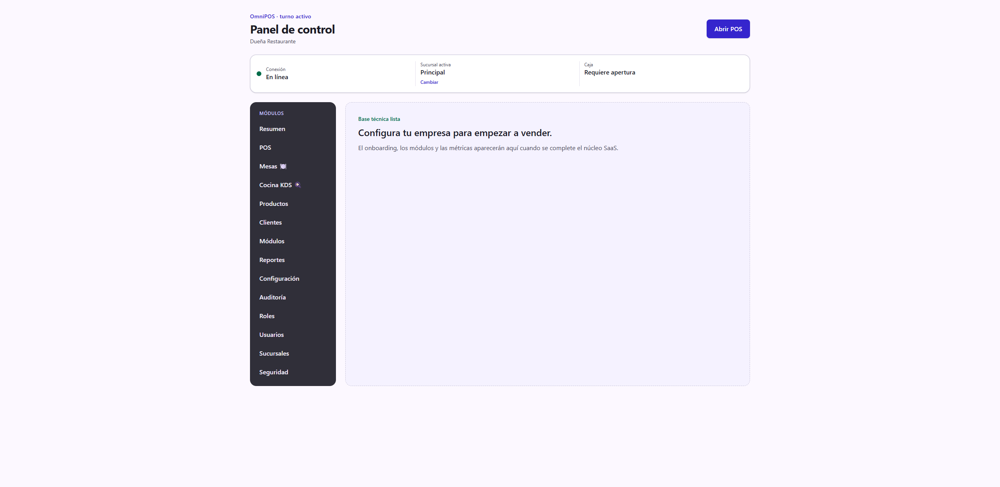
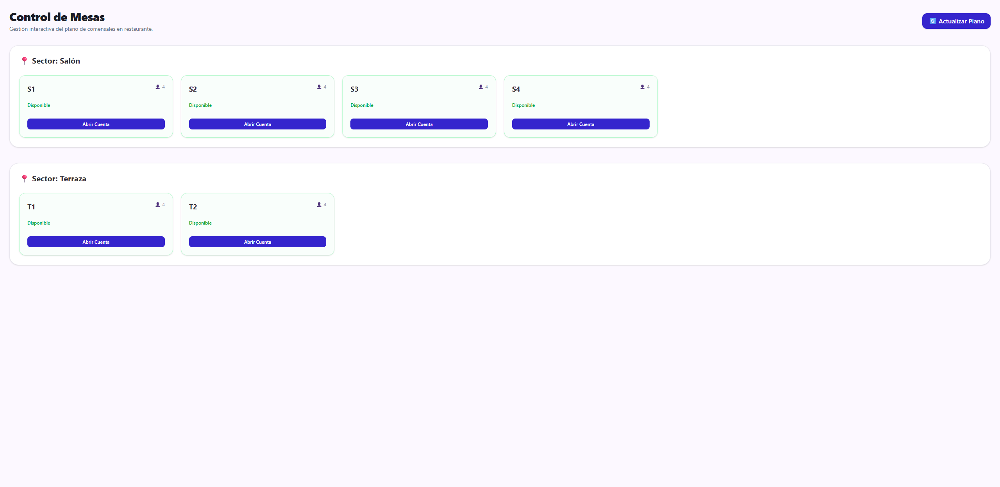
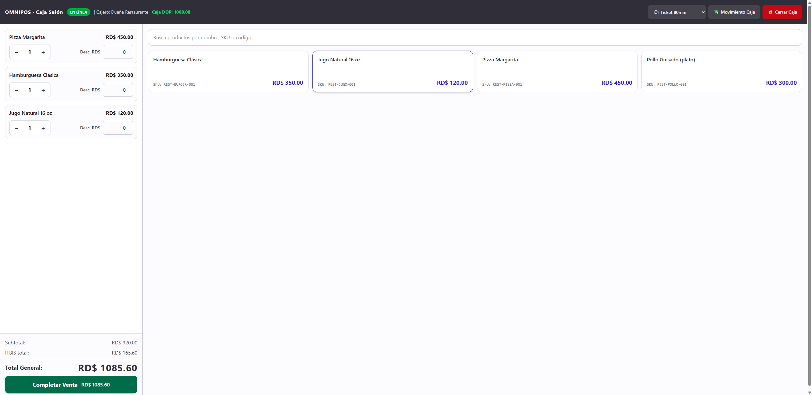
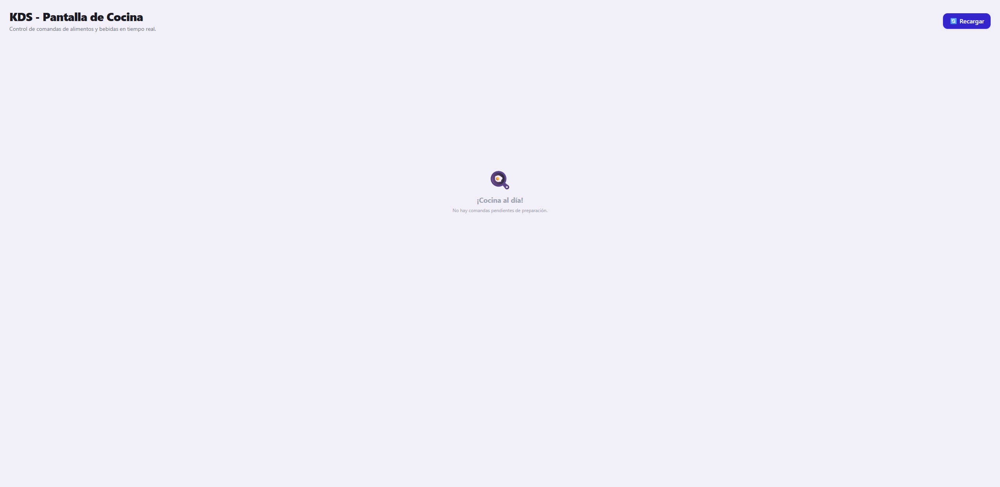

# Guía de uso — Restaurante 🍽️

**Cuenta demo:** `demo.restaurante@omnipos.test` · contraseña `Password123!`
**Empresa:** Restaurante El Fogón

En un restaurante el trabajo gira alrededor del **plano de mesas**: abres una
cuenta en la mesa, tomas la orden, la cocina la prepara (pantalla KDS) y al
final cobras y liberas la mesa.

> Antes de empezar, revisa **[Acceso al sistema](../_comun/GUIA.md)** para
> iniciar sesión y elegir la sucursal.

## El panel del restaurante

En el menú lateral verás los módulos del giro: **Mesas 🍽️**, **Cocina KDS 🍳**,
**Productos** (el menú), **POS**, además de Clientes, Reportes y Configuración.

---

## Ciclo operativo completo

### Paso 1 — El plano de mesas

Entra a **Mesas**. Verás los **sectores** (Salón, Terraza) con sus mesas y el
estado de cada una (Disponible / Ocupada). En la demo hay Salón (S1–S4) y
Terraza (T1–T2).

### Paso 2 — Abrir cuenta en una mesa

Cuando llegan comensales, pulsa **Abrir Cuenta** en la mesa correspondiente.
La mesa pasa a **Ocupada** y se abre su orden en el POS para empezar a tomar el
pedido.

### Paso 3 — Tomar la orden (POS)

En el **POS** tocas los platos y bebidas del menú para agregarlos a la orden de
esa mesa. Puedes ajustar cantidades y descuentos igual que en una venta normal.
Al enviar la orden, los ítems de cocina viajan a la pantalla KDS.

### Paso 4 — La cocina (KDS)

Entra a **Cocina KDS**. Es la pantalla de la cocina: muestra las **comandas**
pendientes con sus platos. El personal marca cada comanda como preparada a
medida que la despacha. Así el salón sabe qué está listo para servir. Cuando no
hay nada pendiente, muestra **"¡Cocina al día!"** (como en la imagen).

### Paso 5 — Cobrar y cerrar la mesa

Cuando el cliente pide la cuenta, desde el POS de esa mesa pulsas **Completar
Venta**, eliges el comprobante y el método de pago (efectivo, tarjeta,
mixto…), igual que en la [guía de Ferretería](../Ferreteria/GUIA.md#paso-5--cobrar).
Al confirmar se emite el comprobante y la **mesa vuelve a Disponible**.

> El restaurante también admite **propina de ley (10%)**: se activa con la
> casilla en el modal de cobro.

---

## Resumen del ciclo

1. **Mesas** → ver el plano por sector.
2. **Abrir Cuenta** en la mesa → se abre su orden.
3. **POS** → tomar el pedido → enviar a cocina.
4. **Cocina KDS** → preparar y despachar las comandas.
5. **Completar Venta** → cobrar → la mesa se libera.
