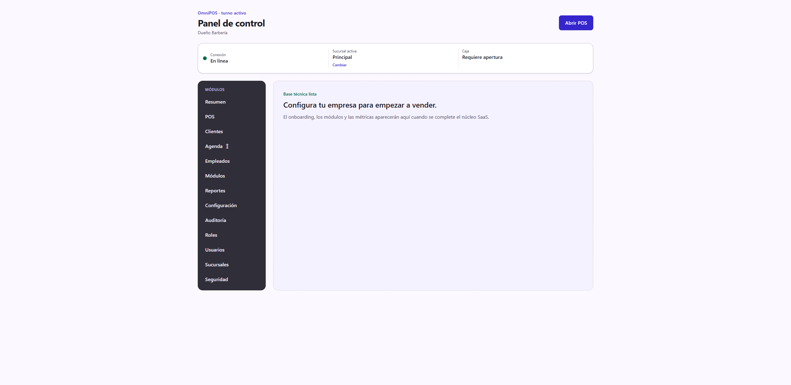
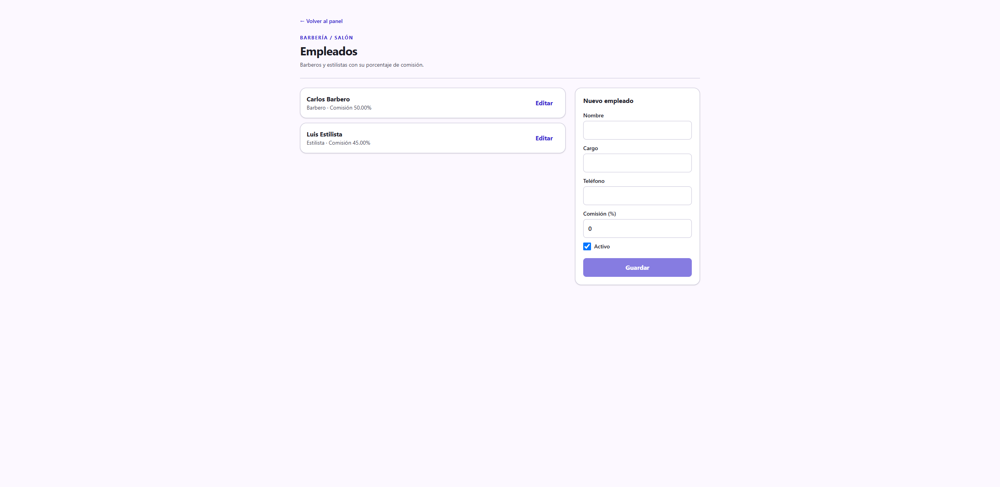
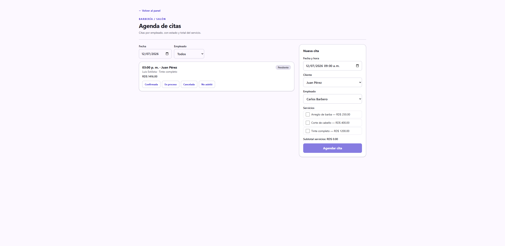

# Guía de uso — Salón / Barbería 💈

**Cuenta demo:** `demo.barberia@omnipos.test` · contraseña `Password123!`
**Empresa:** Barbería La Navaja

En una barbería o salón el trabajo gira alrededor de la **Agenda de citas**:
cada cliente reserva un servicio (corte, barba, tinte) con un empleado, y la
cita avanza por estados hasta completarse. Los productos de reventa (gel,
shampoo) se cobran aparte en el POS.

> Antes de empezar, revisa **[Acceso al sistema](../_comun/GUIA.md)** para
> iniciar sesión y elegir la sucursal.

## El panel de la barbería

Al entrar verás en el menú lateral los módulos propios del giro: **Agenda 💈**,
**Empleados**, además de Clientes, Reportes y Configuración.



---

## Ciclo operativo completo

### Paso 1 — Registrar a tus barberos (Empleados)

Entra a **Empleados**. Aquí registras a cada barbero o estilista con su
**cargo** y su **porcentaje de comisión** (lo que gana por cada servicio). En
la demo ya están Carlos Barbero (50%) y Luis Estilista (45%).

Para agregar uno nuevo: completa **Nombre**, **Cargo**, **Teléfono** y
**Comisión (%)**, deja marcado **Activo** y pulsa **Guardar**.



### Paso 2 — Ver la agenda del día

Entra a **Agenda 💈**. Arriba eliges la **Fecha** y puedes filtrar por
**Empleado**. El listado central muestra las citas de ese día con su hora,
cliente, servicio, total y **estado**.


### Paso 3 — Agendar una cita nueva

En el panel derecho **Nueva cita**:

1. Elige la **Fecha y hora**.
2. Selecciona el **Cliente** (o déjalo sin cliente para un walk-in).
3. Asigna el **Empleado** que atenderá.
4. Marca uno o varios **Servicios**. El **Subtotal** se calcula solo (con ITBIS incluido).
5. Pulsa **Agendar cita**.



> En el ejemplo se agendó *Corte de cabello + Arreglo de barba* con Carlos
> Barbero. El total del servicio incluye el ITBIS automáticamente.

### Paso 4 — Hacer avanzar la cita por sus estados

Cada cita tiene un ciclo de vida. Desde la tarjeta de la cita pulsas el botón
del **siguiente estado**:

```
Pendiente → Confirmada → En proceso → Completada
```

En cualquier punto antes de completar puedes marcar **Cancelada** o
**No asistió**. El sistema solo permite las transiciones válidas.


### Paso 5 — Cobrar

- **Servicios:** hoy los servicios se registran y controlan desde la Agenda. El cobro del servicio se hace en la caja (POS) o al momento de entregar; la facturación fiscal de la cita (convertir la cita en factura con NCF) está en el plan de mejoras.
- **Productos de reventa** (gel, cera, shampoo): se venden por el **POS** como en cualquier tienda. Para venderlos, activa el módulo **Productos** en Configuración → Módulos y regístralos en **Productos**; aparecerán en el POS. El flujo de cobro en el POS es idéntico al de la [guía de Ferretería](../Ferreteria/GUIA.md#paso-4--abrir-la-caja).

---

## Resumen del ciclo

1. **Empleados** → registrar barberos con su comisión.
2. **Agenda** → ver el día → **Nueva cita** (cliente + empleado + servicios).
3. Avanzar la cita: Pendiente → Confirmada → En proceso → Completada.
4. Cobrar productos de reventa por el POS.
