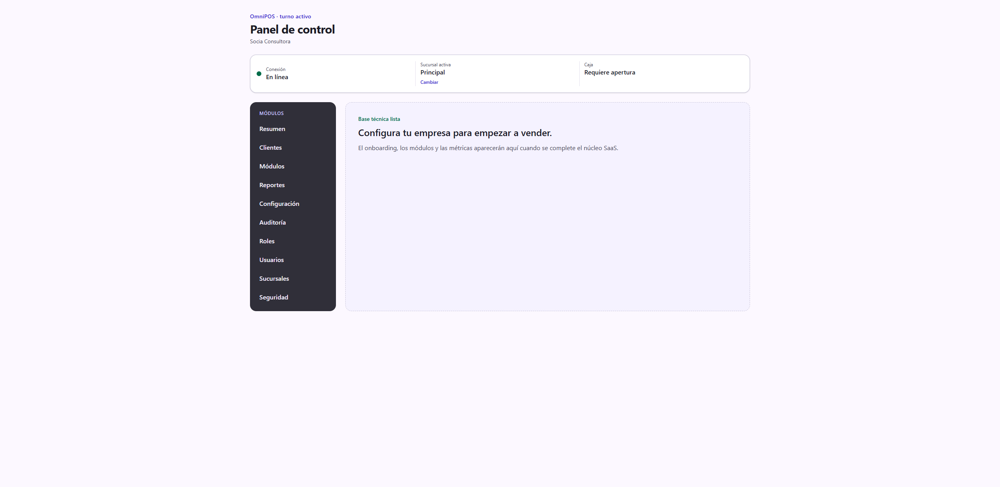
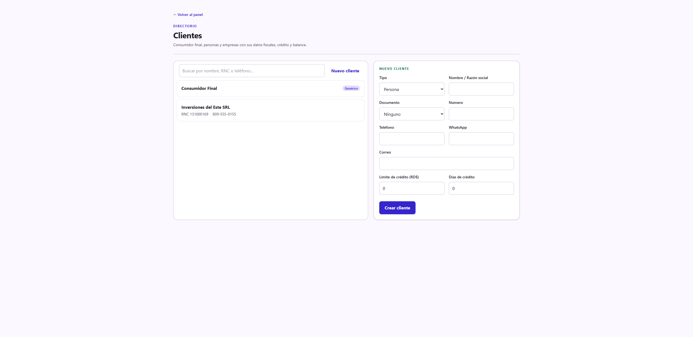

# Guía de uso — Servicios profesionales 💼

**Cuenta demo:** `demo.servicios@omnipos.test` · contraseña `Password123!`
**Empresa:** Consultores Pro

Un negocio de servicios profesionales (consultoría, asesoría, auditoría) no
vende productos ni maneja caja de mostrador: su operación gira alrededor del
**catálogo de servicios**, sus **clientes** y las **cotizaciones** que se
convierten en factura.

> Antes de empezar, revisa **[Acceso al sistema](../_comun/GUIA.md)**.

## El panel de servicios profesionales

Su preset es liviano: en el menú verás **Clientes**, **Reportes**,
**Configuración** y las opciones de administración (Módulos, Auditoría, Roles,
Usuarios, Sucursales, Seguridad). No trae POS ni Productos.

---

## Ciclo operativo

### Paso 1 — Registrar clientes

Entra a **Clientes** y registra las empresas o personas a las que prestas
servicio, con su **razón social** y **RNC** para poder emitirles crédito fiscal.
En la demo está *Inversiones del Este SRL*.

### Paso 2 — Catálogo de servicios y cotizaciones

El giro trae activos los módulos **Servicios** y **Cotizaciones**. En la demo ya
hay sembrados tres servicios (Consultoría por hora, Auditoría de procesos,
Asesoría fiscal mensual).

> **Estado actual (importante):** la **pantalla dedicada para administrar el
> catálogo de servicios y emitir/convertir cotizaciones está en el plan de
> desarrollo** (backlog post-v1). Hoy los servicios se aprovisionan por
> configuración y se consumen desde los verticales que usan agenda u órdenes
> (barbería, taller). Para **facturar servicios** de inmediato puedes activar el
> módulo **POS Touch** en Configuración → Módulos y cobrarlos como líneas de
> venta.

---

## Resumen del ciclo

1. **Clientes** → registrar a quién facturas (con RNC para crédito fiscal).
2. Catálogo de **Servicios** (hoy sembrado; pantalla de gestión y
   **Cotizaciones** en el roadmap).
3. Para cobrar hoy: activar **POS Touch** y facturar el servicio como línea, o
   usar un vertical con agenda/órdenes.

> Este giro es el menos desarrollado en la interfaz: su valor completo
> (cotización → factura) llega cuando se construya la pantalla de cotizaciones.
