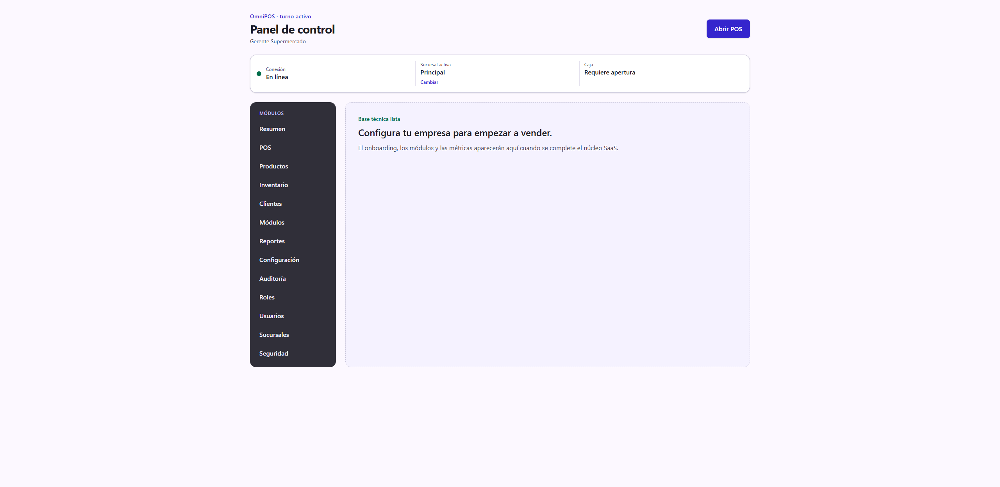
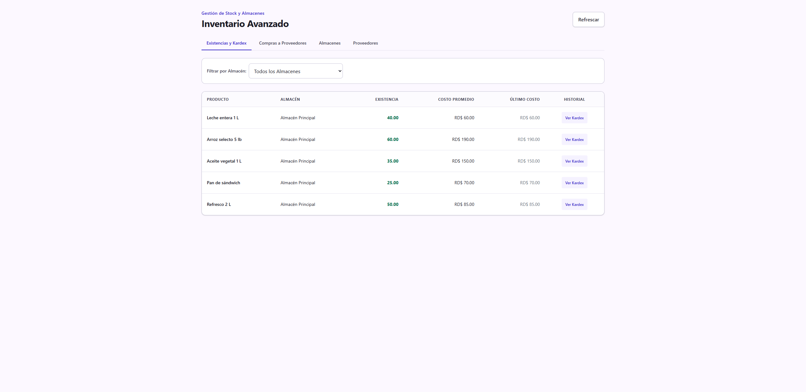
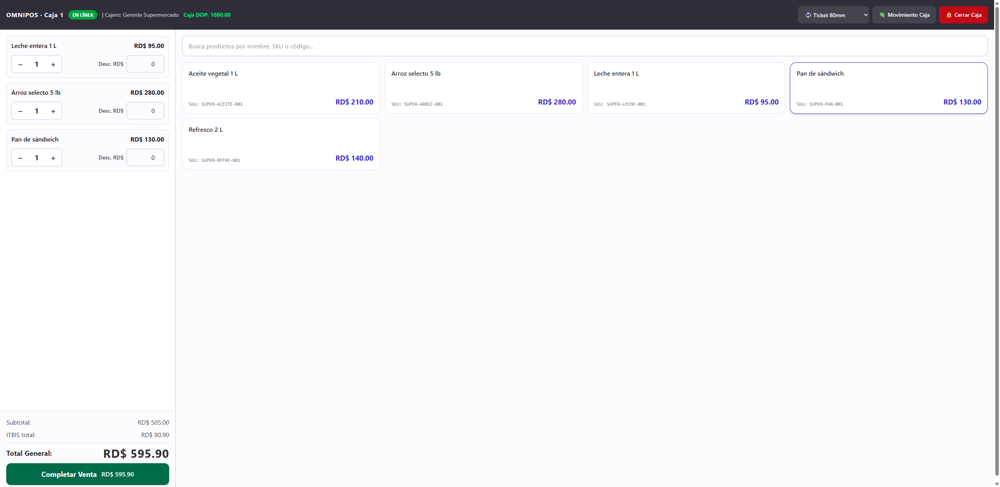
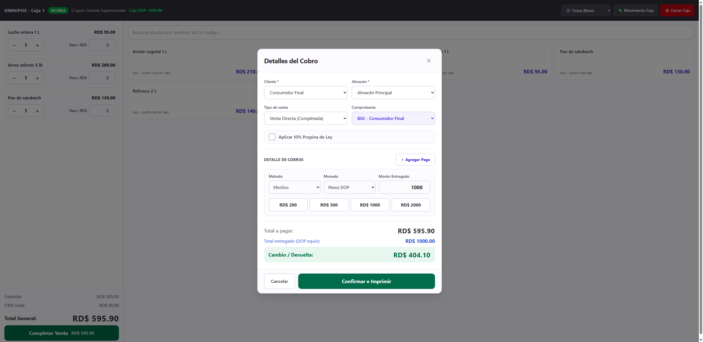

# Guía de uso — Supermercado 🛒

**Cuenta demo:** `demo.super@omnipos.test` · contraseña `Password123!`
**Empresa:** Supermercado La Económica

Un supermercado es venta al detalle de alto volumen con **inventario avanzado**:
además de existencias, controla **lotes** y **fechas de vencimiento** para
despachar primero lo que caduca antes (regla **FEFO**). El cobro en el POS es
igual al de una ferretería.

> Antes de empezar, revisa **[Acceso al sistema](../_comun/GUIA.md)** para
> iniciar sesión y elegir la sucursal.

## El panel del supermercado

En el menú lateral verás **Productos**, **Inventario** (avanzado), **POS**,
**Clientes**, **Reportes** y **Configuración**.

---

## Ciclo operativo completo

### Paso 1 — Existencias con lotes y vencimientos

Entra a **Inventario**. La pestaña **Existencias y Kardex** muestra cada
producto con su existencia y costo. La diferencia con un negocio simple es que
la entrada de mercancía se registra por **lote** y **fecha de vencimiento**, de
modo que el sistema puede aplicar **FEFO** (sale primero lo que vence antes) y
avisar de productos próximos a caducar.

> En la demo, productos como la leche, el pan y el aceite se cargaron con lote y
> fecha de vencimiento; el arroz y el refresco, sin vencimiento.

### Paso 2 — Cargar mercancía (compras)

En **Inventario → Compras a Proveedores** registras las entradas: producto,
cantidad, costo, y —cuando aplica— **lote** y **vencimiento**. Cada entrada
suma stock y actualiza el costo promedio.

### Paso 3 — Vender en el POS

Entra a **POS**, **abre la caja** con su fondo inicial y arma la venta tocando
los productos (o escaneando el código de barras). El flujo de carrito, cobro y
comprobante es idéntico al de la
[guía de Ferretería](../Ferreteria/GUIA.md#paso-4--abrir-la-caja).

### Paso 4 — Cobro y comprobante

Pulsa **Completar Venta**, elige el comprobante (B02 Consumidor Final por
defecto) y el método de pago, y **Confirma e Imprime**. Al vender, el stock baja
tomando primero el lote que vence antes (FEFO).

### Paso 5 — Cierre y reportes

Cierra la caja con su arqueo al final del turno y revisa **Reportes** para ver
ventas por producto/categoría/método y los formatos **DGII 606/607/608**.

---

## Resumen del ciclo

1. **Inventario** → cargar mercancía por lote/vencimiento (FEFO).
2. **POS** → abrir caja.
3. Escanear/tocar productos → armar carrito → **Completar Venta**.
4. Cobrar → **Confirmar e Imprimir** (el stock baja por FEFO).
5. **Cerrar Caja** y revisar **Reportes**.
