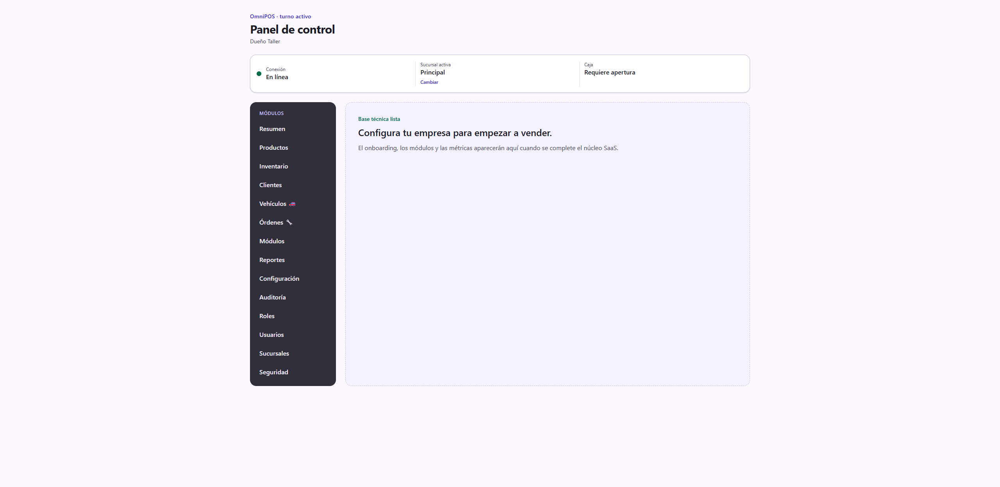
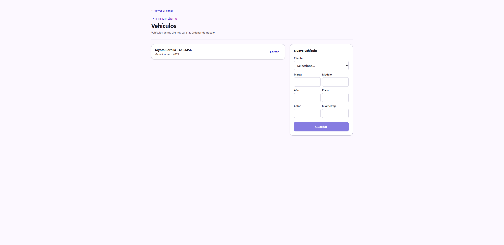
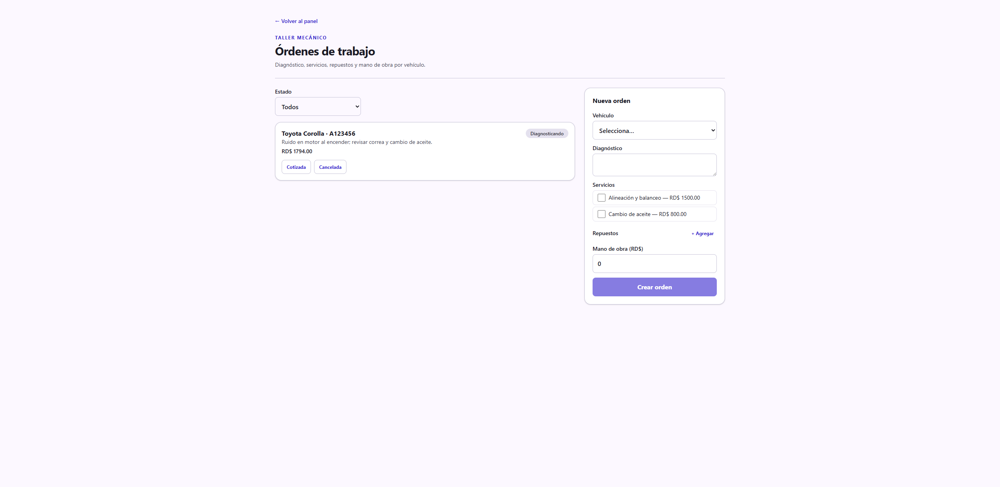
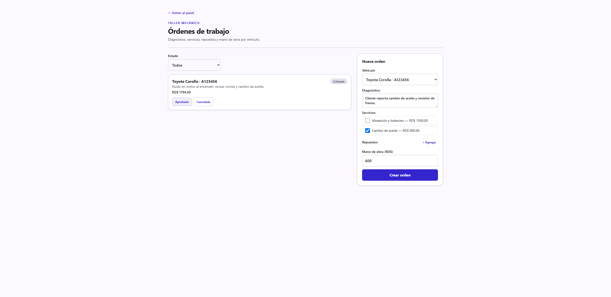

# Guía de uso — Taller mecánico 🚗

**Cuenta demo:** `demo.taller@omnipos.test` · contraseña `Password123!`
**Empresa:** Taller AutoMax

En un taller el trabajo gira alrededor de la **orden de trabajo**: registras el
vehículo del cliente, abres una orden con el diagnóstico, le sumas servicios,
repuestos y mano de obra, y la orden avanza por estados hasta entregar el
vehículo.

> Antes de empezar, revisa **[Acceso al sistema](../_comun/GUIA.md)** para
> iniciar sesión y elegir la sucursal.

## El panel del taller

En el menú lateral verás **Vehículos 🚗** y **Órdenes 🔧**, además de Clientes,
Inventario (repuestos), Reportes y Configuración.



---

## Ciclo operativo completo

### Paso 1 — Registrar el vehículo del cliente

Entra a **Vehículos**. En **Nuevo vehículo** eliges el **Cliente** y anotas
**Marca**, **Modelo**, **Año**, **Placa**, **Color** y **Kilometraje**. Pulsa
**Guardar**. En la demo ya está el Toyota Corolla 2019 de María Gómez.



### Paso 2 — Ver las órdenes de trabajo

Entra a **Órdenes 🔧**. Arriba filtras por **Estado**. El listado muestra cada
orden con su vehículo, diagnóstico, total y estado actual.



### Paso 3 — Crear una orden nueva

En el panel derecho **Nueva orden**:

1. Selecciona el **Vehículo**.
2. Escribe el **Diagnóstico** (qué reportó el cliente / qué se encontró).
3. Marca los **Servicios** a realizar (cambio de aceite, alineación…).
4. Agrega **Repuestos** con **+ Agregar** (cantidad × precio).
5. Indica la **Mano de obra** en RD$.
6. Pulsa **Crear orden**.

El **total** se calcula con ITBIS en los servicios, más repuestos y mano de
obra.


### Paso 4 — Hacer avanzar la orden por sus estados

La orden tiene un ciclo de vida. Desde la tarjeta pulsas el **siguiente estado**:

```
Recibida → Diagnosticando → Cotizada → Aprobada → En proceso → Lista → Entregada
```

En cualquier punto puedes marcar **Cancelada**. El sistema solo permite las
transiciones válidas (por ejemplo, no se puede "Entregar" algo que aún no está
"Listo").



### Paso 5 — Cobrar

Los repuestos con inventario descuentan stock. Hoy el cobro de la orden se hace
por el **POS** (o al entregar); la facturación fiscal directa de la orden
(convertir la orden en factura con NCF) está en el plan de mejoras.

---

## Resumen del ciclo

1. **Vehículos** → registrar el auto del cliente.
2. **Órdenes** → **Nueva orden** (vehículo + diagnóstico + servicios + repuestos + mano de obra).
3. Avanzar: Recibida → Diagnosticando → Cotizada → Aprobada → En proceso → Lista → Entregada.
4. Cobrar por el POS al entregar.
