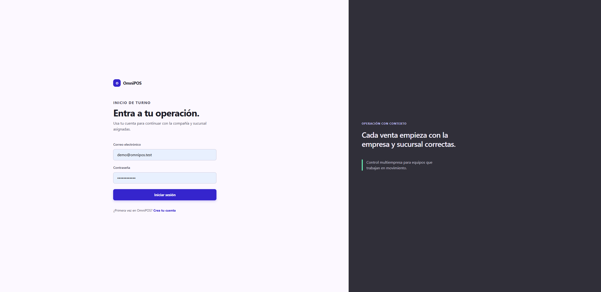
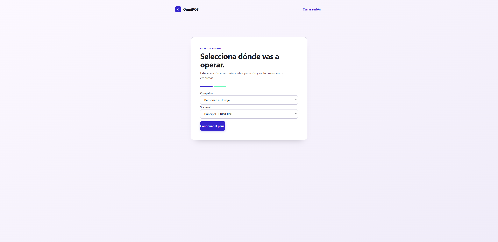

# Acceso al sistema (común a todos los giros)

Todo usuario empieza igual: inicia sesión y elige **dónde** va a operar
(compañía y sucursal). Esa selección acompaña cada venta y evita cruces entre
empresas.

## Paso 1 — Iniciar sesión

Abre la aplicación en el navegador. Escribe tu **correo** y **contraseña** y
pulsa **Iniciar sesión**.

> Si tu cuenta tiene verificación en dos pasos (2FA) activada, después de la
> contraseña aparecerá un campo para el **código de 6 dígitos** de tu app
> autenticadora.

## Paso 2 — Elegir compañía y sucursal

Tras entrar, selecciona la **compañía** y la **sucursal** donde trabajarás hoy
y pulsa **Continuar al panel**.

> Si perteneces a una sola empresa con una sucursal, ya vienen preseleccionadas:
> solo pulsa **Continuar al panel**. Puedes cambiar de sucursal en cualquier
> momento desde el panel, en **Sucursal activa → Cambiar**.

## Paso 3 — El panel de control

Llegas al **Panel de control**. A la izquierda está el **menú de módulos**
(cambia según el giro de tu empresa) y arriba el estado operativo: conexión,
sucursal activa y estado de la caja.

Desde aquí abres cualquier módulo. Continúa con la guía de tu tipo de negocio.

## Cerrar sesión

En la pantalla de selección de contexto (o desde el panel) usa **Cerrar
sesión**. Por seguridad, cierra sesión al terminar tu turno en una terminal
compartida.
